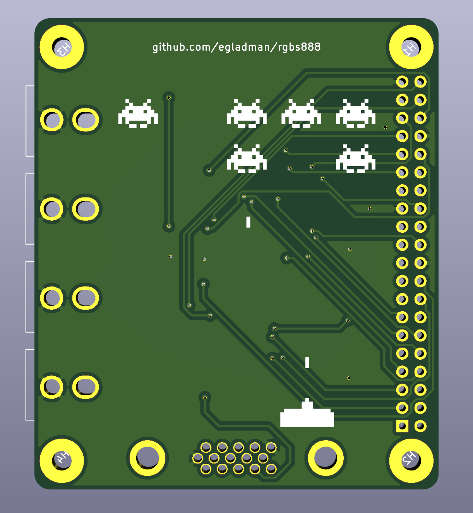

# rgbs888

Passive 24-bit RGBs adapter for Raspberry-Pi B+




## Bill of Materials
- 1 2x20 2.5mm Female Header
- 4 RCA right angle female pcb mount connectors
- 1 DB15 female connector *Optional*
- 1 120 ohm 0805 resistor *We don't care about the tolerance as much, so 5% would be sufficient*
- 3 549 ohm 0805 1% tolerance resistor
- 3 1.1K ohm 0805 1% tolerance resistor
- 3 2.21K ohm 0805 1% tolerance resistor
- 3 4.42K ohm 0805 1% tolerance resistor
- 3 8.87K ohm 0805 1% tolerance resistor
- 3 17.8K ohm 0805 1% tolerance resistor
- 3 35.7K ohm 0805 1% tolerance resistor
- 3 71.5K ohm 0805 1% tolerance resistor

```
MOUSER PART NUMBERS
========================

Connectors
806-KLPX-0848A-2-B
523-7HDE15SDH4RHNVGA

Resistors
667-ERJ-6GEYJ121V
652-CR0805FX-5490ELF
603-RC0805FR-131K1L
603-RC0805FR-072K21L
667-ERJ-6ENF4421V
667-ERJ-6ENF8871V
667-ERJ-6ENF1782V
667-ERJ-6ENF3572V
667-ERJ-6ENF7152V
```

## License

Copyright © 2020 Eli Gladman 

This document and the related databases are free: you can redistribute it and/or modify it under the terms of the GNU General Public License as published by the Free Software Foundation, either version 3 of the License, or any later version. This document and the related databases are distributed in the hope that it will be useful, but WITHOUT ANY WARRANTY; without even the implied warranty of MERCHANTABILITY or FITNESS FOR A PARTICULAR PURPOSE. See the GNU General Public License for more details. You should have received a copy of the GNU General Public License along with this database. If not, see http://www.gnu.org/licenses/
